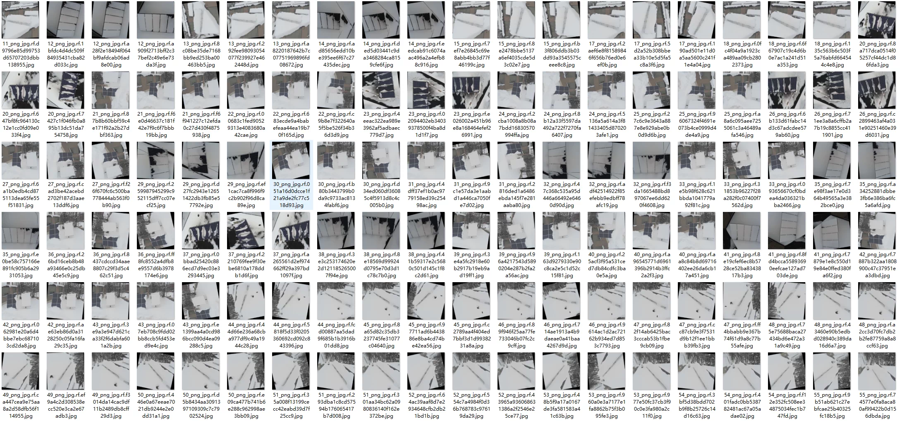
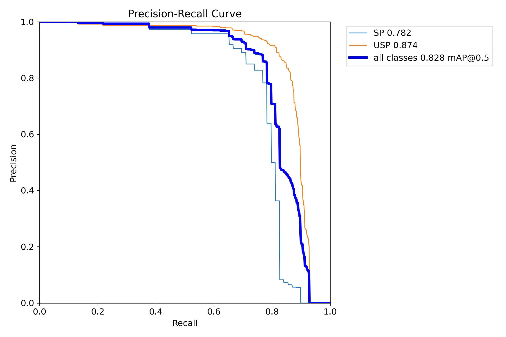
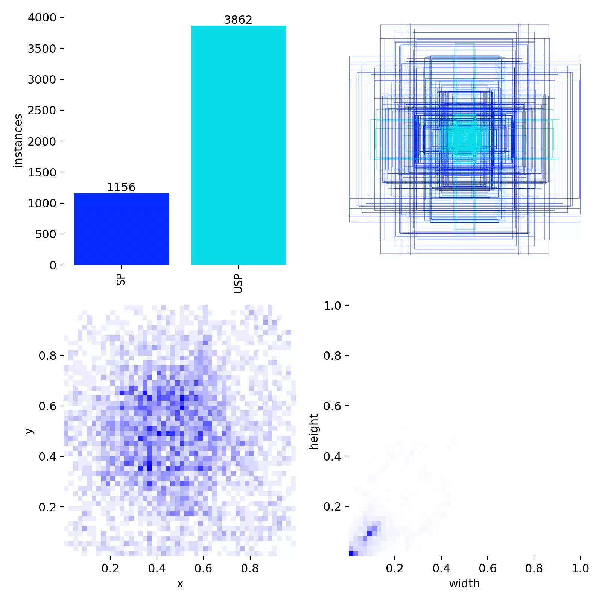
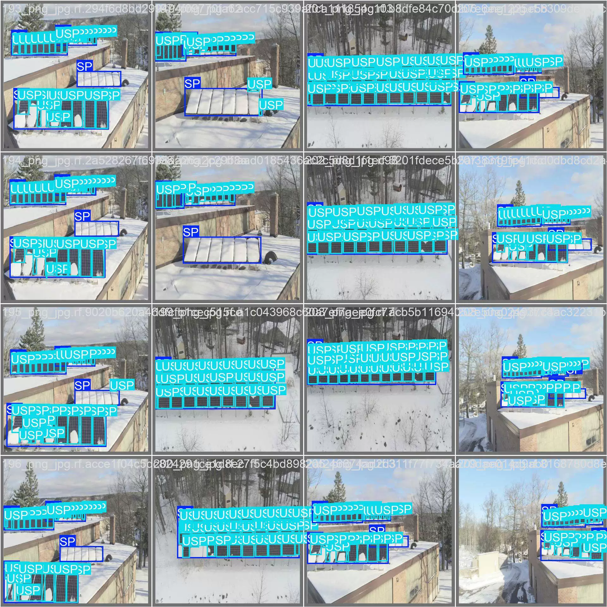
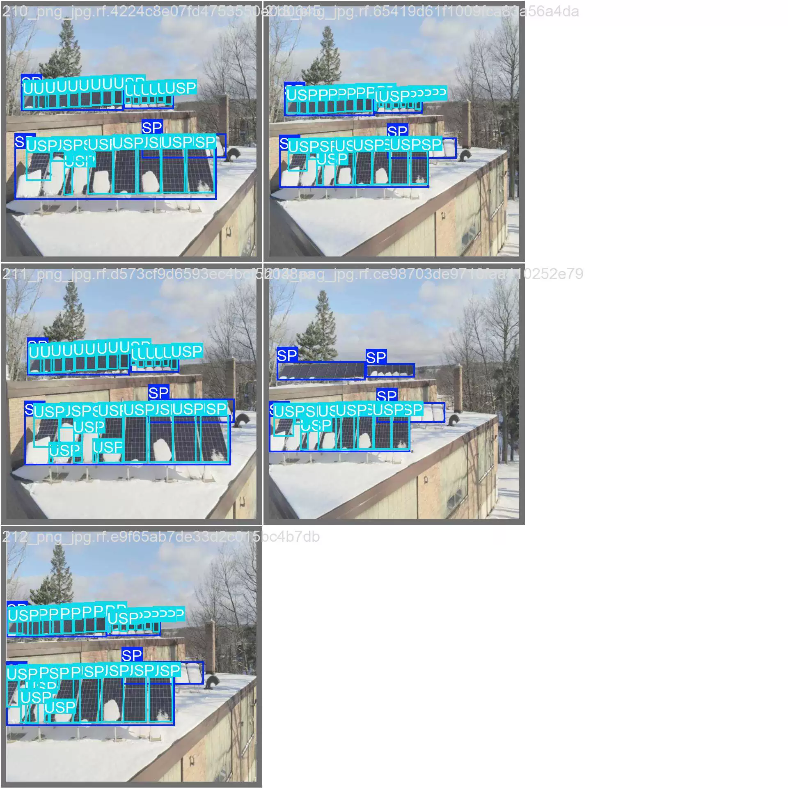
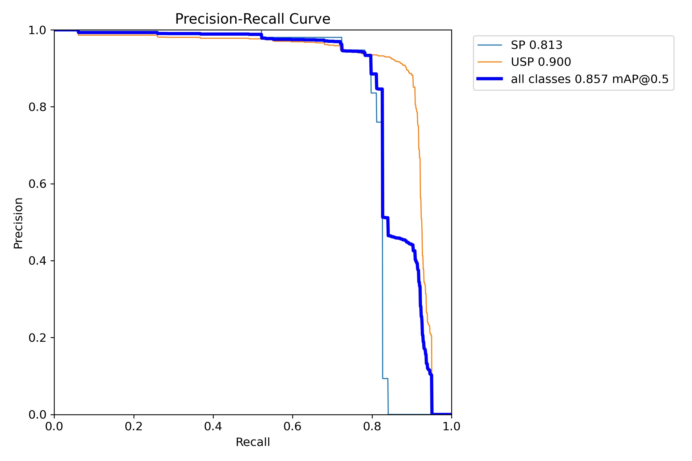
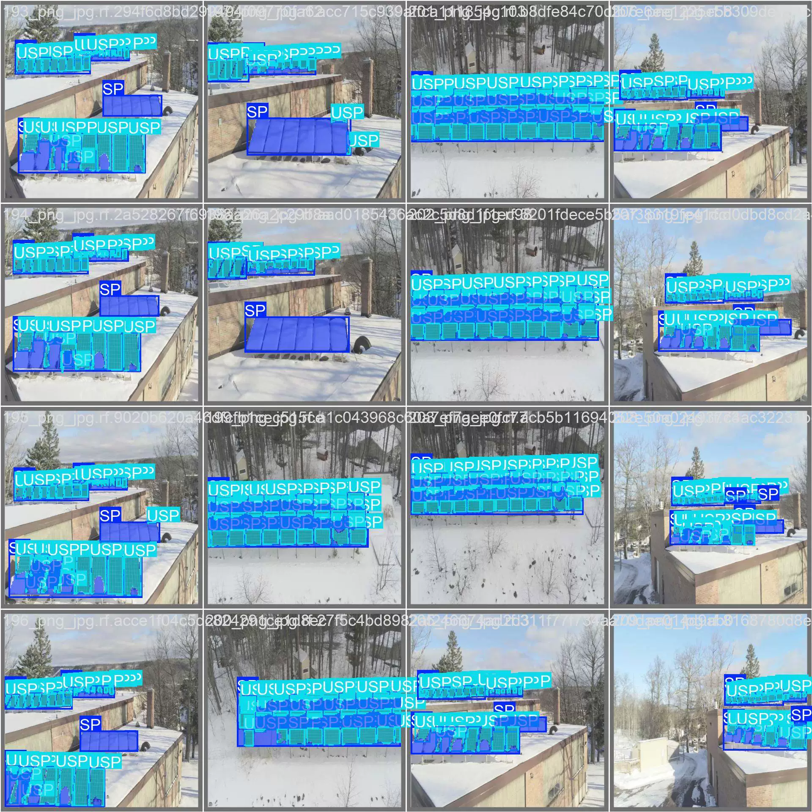
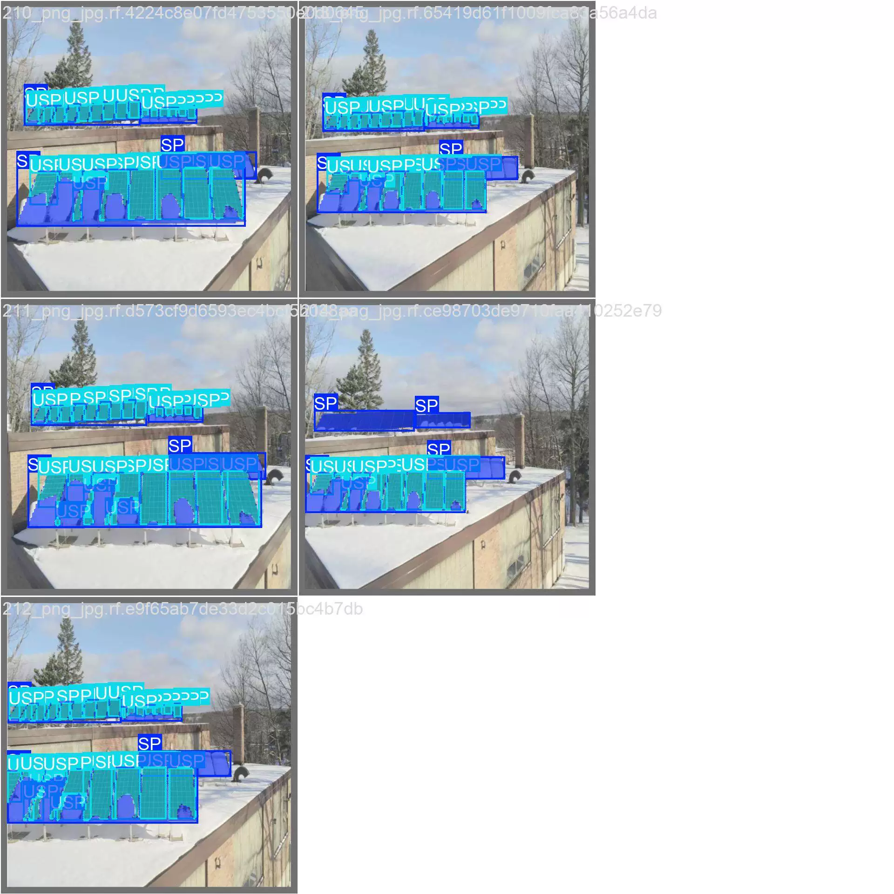

## Body

The UAV Photovoltaic Panel Snow Cover Target Detection and Segmentation Dataset in YOLO format

Totally 588 images, labeled separately, and divided into train (519), valid (48), test (21)

It is divided into 2 categories, SP and USP, covering snow-covered photovoltaic panels and thin snow-covered photovoltaic panels.

The dataset includes both target detection format and segmentation format.
YOLOv8s target detection weight file (Training rounds 100, pre-trained model YOLOv8s.pt, mAP@0.5 0.828) with training results files
YOLO11m-seg segmentation weight file (Training rounds 100, pre-trained model YOLOv8s.pt, mAP@0.5 0.857) with training results files

## Images

item_1061206226776

Here is a pay link on Stripe ( https://buy.stripe.com/3cs8yP7sY87d0vu9AB ). Please contact me lonlonago@foxmail.com after funding $89, and I will send you a complete data files , thank you!

